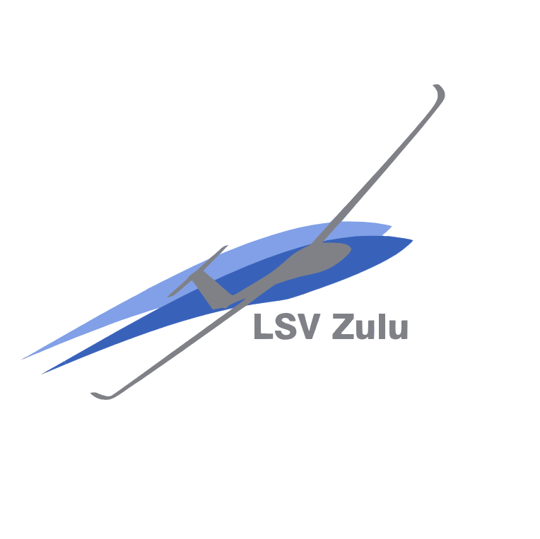

[](https://github.com/php-perfect/aviation-calculator/actions/workflows/rust.yml)
[](https://opensource.org/license/mit/)
[](https://github.com/sponsors/nico-loeber?frequency=recurring&sponsor=nico-loeber)

# Aviation Calculator

The goal of this library is to provide a collection of useful calculations for aviators to use in other projects.

The functions are grouped by the general topics of navigation, meteorology and utilities, which mainly contain unit
conversion functions. There are also FK9 Mk VI specific performance calculations.

All calculations are based on official sources and use official examples to verify correctness in automated tests.

Feel free to use this library in your projects and to [contribute](CONTRIBUTING.md) to it.

## Usage

You can install this library as a crate using the rust package manager cargo by running `cargo add aviation-calculator`
in your project.

For a complete list of available functions, see the automatically
generated [documentation](https://docs.rs/crate/aviation-calculator/latest/target-redirect/x86_64-unknown-linux-gnu/aviation_calculator/index.html)
for this crate.

### Some Examples

#### Get ICAO Default temperature for your current location

```rust
use aviation_calculator::meteorology::*;

let pressure_altitude: f64 = pressure_altitude_by_qnh(996.0, 113.7);
let icao_default_temperature = icao_temperature(pressure_altitude).unwrap();
```

#### Calculate wind correction angle

```rust
use aviation_calculator::navigation::*;

let my_speed = 110.0;
let wind_speed = 12.0;
let acute_wind_angle = 20.0;

let wca = wind_correction_angle(my_speed, wind_speed, acute_wind_angle);
```

And much more...

## Sources

* [ICAO-Standardatmosphäre (ISA) - Deutscher Wetterdienst](https://www.dwd.de/DE/service/lexikon/begriffe/S/Standardatmosphaere_pdf.pdf?__blob=publicationFile&v=3)
* [Flight Manual FK 9 Mk VI - B & F Technik Vertriebs GmbH Speyer – Germany](http://www.flugservice-speyer.de/Flugservice_Speyer/Manuals_files/FK9%20Mk%20VI%20Rev%204%20English.pdf)
* [Flugsicherheitsmitteilung (fsm) 3/75 - http://www.pilotundrecht.de/](http://www.pilotundrecht.de/TEXTE/DOWNLOAD/FSM/fsm_75_3.pdf)

## Supported by

[](https://lsv-zellhausen.de/)
[](https://jb.gg/OpenSourceSupport)
